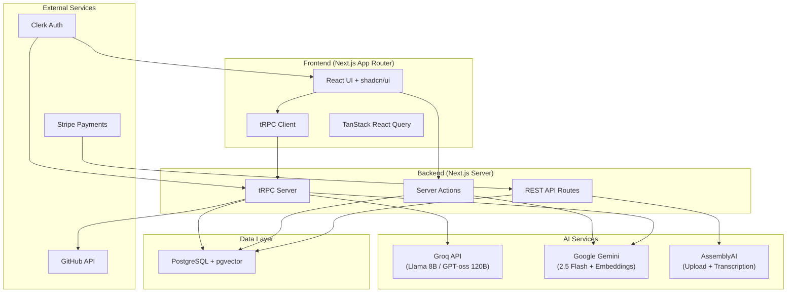
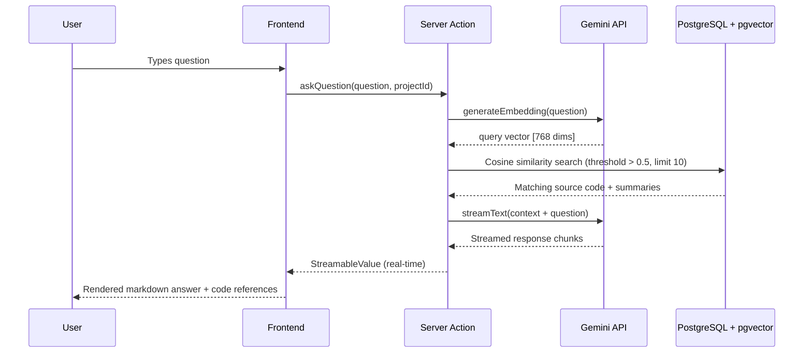

# Octogen

An AI-powered GitHub repository intelligence platform that helps developers understand codebases through natural language Q&A, automated commit summarization, and meeting transcription analysis.

---

## Short Description

Octogen is a full-stack web application that connects to GitHub repositories, indexes their source code using vector embeddings, and provides an AI-powered question-answering interface. Developers can ask natural language questions about any connected codebase and receive contextual answers grounded in the actual source code. It also summarizes commit history using AI and transcribes meeting recordings into structured, searchable issues.

---

## Why I Built This

Understanding a new codebase is one of the most time-consuming tasks in software development. Whether you're onboarding onto a team, reviewing a pull request, or trying to trace a bug through unfamiliar code, you spend more time reading and searching than actually writing code.

Existing tools like GitHub's built-in search or `grep` are keyword-based — they find text matches, not semantic meaning. AI chatbots like ChatGPT can answer coding questions, but they don't have access to your specific repository's context.

I built Octogen to bridge that gap: an AI assistant that actually understands *your* codebase, not just general programming knowledge.

---

## Problem Being Solved

**The real-world problem:** Developers waste significant time navigating unfamiliar codebases, deciphering commit messages that lack context, and extracting action items from long meetings.

**Target users:** Software engineers — especially those onboarding onto new projects, working across multiple repositories, or collaborating in teams.

**Before Octogen:**
1. Search through files manually or use keyword-based search tools
2. Read commit diffs line-by-line to understand what changed and why
3. Re-watch or re-listen to entire meetings to find specific discussion points

**With Octogen:**
1. Ask "Which file handles user authentication?" and get a direct answer with source code references
2. See AI-generated summaries for every commit — what changed and why
3. Upload a meeting recording and get auto-extracted issues with timestamps

---

## Features

### 🔍 AI-Powered Codebase Q&A (RAG Pipeline)
Ask natural language questions about your repository and receive contextual answers backed by actual source code. The system uses Retrieval-Augmented Generation (RAG): questions are embedded into vectors, matched against indexed source code embeddings via cosine similarity, and the most relevant files are fed as context to Gemini 2.5 Flash for answer generation. Answers stream in real-time and display the referenced source files with syntax-highlighted code.

### 📝 Intelligent Commit Summarization
When a project is created or the dashboard is loaded, Octogen fetches the latest commits from the GitHub API, retrieves their diffs, and generates concise AI summaries. A tiered model selection strategy routes small diffs to fast models (Llama 3.1 8B), medium diffs to larger models (GPT-oss 120B via Groq), and large diffs to Gemini Flash's 1M context window. A fallback chain ensures reliability.

### 🎙️ Meeting Transcription & Issue Extraction
Upload audio recordings of meetings (MP3, WAV, M4A, AAC, FLAC up to 50MB). Files are uploaded directly to AssemblyAI's temporary storage via `client.files.upload()`, eliminating the need for external storage buckets. Transcription uses AssemblyAI's auto-chaptering feature, and each chapter is extracted as a structured issue with a headline, summary, gist, and timestamps. Works seamlessly on Vercel and other serverless platforms.

### 👥 Team Collaboration
Invite team members to projects via shareable links (`/join/{projectId}`). All team members can view the same commit history, ask questions, and access meeting transcripts. Team member avatars are displayed on the dashboard.

### 💳 Credit-Based Usage System
Each file in a repository costs one credit to index. Users start with 150 free credits. Additional credits can be purchased via Stripe Checkout at a rate of $2 per 100 credits. The billing page shows current credit balance and provides a slider to select purchase amounts.

> [!NOTE]
> **Test Environment:** The Stripe integration is currently running in test mode to showcase the checkout functionality. No real payments will be processed. Please use [Stripe test cards](https://stripe.com/docs/testing) if you would like to test the checkout flow.

### 📂 Project Management
Create, switch between, and archive projects from the sidebar. Each project is linked to a GitHub repository URL. Soft-delete (archive) support allows projects to be hidden without data loss.

---

## Architecture Overview



### How the RAG Pipeline Works



---

## Tech Stack

### Frontend
| Technology | Purpose |
|---|---|
| **Next.js 15** (App Router + Turbopack) | React framework with server components, server actions, and file-based routing |
| **React 19** | UI library |
| **Tailwind CSS 4** | Utility-first styling |
| **shadcn/ui** (Radix primitives) | Pre-built accessible UI components |
| **Framer Motion** | Page transitions, staggered animations, floating dock |
| **React Syntax Highlighter** | Code display in Q&A answers (Lucario theme) |
| **Sonner** | Toast notifications |
| **React Dropzone** | Drag-and-drop file upload for meetings |
| **React Circular Progressbar** | Upload progress visualization |

### Backend
| Technology | Purpose |
|---|---|
| **tRPC v11** | End-to-end typesafe API layer with React Query integration |
| **Zod** | Runtime schema validation for all API inputs |
| **SuperJSON** | Serialization of complex types (dates, etc.) across tRPC |
| **@t3-oss/env-nextjs** | Type-safe environment variable validation |

### Database
| Technology | Purpose |
|---|---|
| **PostgreSQL** | Primary relational database |
| **Prisma ORM v6** | Schema management, migrations, and type-safe queries |
| **pgvector** | Vector similarity search for source code embeddings |

### AI / ML
| Technology | Purpose |
|---|---|
| **Vercel AI SDK** | Unified interface for text generation, streaming, and embeddings |
| **Google Gemini 2.5 Flash** | Primary LLM for Q&A, code summarization, and large diff analysis |
| **Gemini Embedding 001** | 768-dimensional embeddings for source code indexing |
| **Groq** (Llama 3.1 8B / GPT-oss 120B) | Fast inference for small/medium commit diffs |
| **LangChain** | GitHub repository loading and document splitting |
| **js-tiktoken** | Token counting for intelligent model routing |
| **AssemblyAI** | Audio upload + transcription with auto-chaptering |

### Authentication
| Technology | Purpose |
|---|---|
| **Clerk** | User authentication, session management, middleware protection |

### Payments
| Technology | Purpose |
|---|---|
| **Stripe** | Credit purchase checkout sessions and webhook handling |

### Infrastructure
| Technology | Purpose |
|---|---|
| **Docker / Podman** | Local PostgreSQL database via `start-database.sh` |
| **Bun** | Package manager (lockfile: `bun.lock`) |

---

## Project Structure

```
octogen/
├── prisma/
│   └── schema.prisma            # Database schema (User, Project, Commit, Embedding, Meeting, Issue, StripeTransaction)
├── public/
│   ├── octogen-logo.svg         # App logo
│   └── undraw.github.svg        # Illustration for create project page
├── src/
│   ├── app/
│   │   ├── layout.tsx           # Root layout (Clerk, tRPC, Toaster providers)
│   │   ├── page.tsx             # Root redirect → /dashboard
│   │   ├── sync-user/           # Post-signup user sync (Clerk → Prisma)
│   │   ├── sign-in/             # Clerk sign-in page
│   │   ├── sign-up/             # Clerk sign-up page
│   │   ├── api/
│   │   │   ├── trpc/            # tRPC HTTP handler
│   │   │   ├── upload-meeting/  # AssemblyAI upload + Meeting creation
│   │   │   ├── process-meeting/ # Meeting transcription endpoint (AssemblyAI)
│   │   │   └── webhook/stripe/  # Stripe webhook for credit fulfillment
│   │   ├── _components/
│   │   │   └── app-sidebar.tsx  # Main sidebar (project list, billing nav)
│   │   └── (protected)/         # Auth-guarded route group
│   │       ├── layout.tsx       # Sidebar + top bar + floating nav layout
│   │       ├── dashboard/       # Main project dashboard (Q&A, commits, meetings)
│   │       ├── qa/              # Saved Q&A history page
│   │       ├── meetings/        # Meeting list + detail/issues view
│   │       ├── create/          # Create new project form
│   │       ├── billing/         # Credit purchase page
│   │       └── join/[projectId] # Team invite handler
│   ├── components/
│   │   ├── octogen-logo.tsx     # SVG logo component
│   │   └── ui/                  # shadcn/ui primitives (button, card, dialog, etc.)
│   ├── hooks/
│   │   ├── use-projects.ts      # Active project selection (localStorage)
│   │   ├── use-refetch.ts       # Global query invalidation helper
│   │   └── use-mobile.ts       # Responsive breakpoint detection
│   ├── lib/
│   │   ├── ai-providers.ts     # AI model config, tiered selection, fallback chain
│   │   ├── github.ts           # Commit fetching + AI summarization pipeline
│   │   ├── github-loader.ts    # Repo indexing: load files → summarize → embed → store
│   │   ├── commit-helpers.ts   # Token counting, truncation, diff filtering
│   │   ├── assembly.ts         # AssemblyAI upload + transcription + chapter extraction
│   │   ├── stripe.ts           # Stripe checkout session creation
│   │   └── utils.ts            # cn() utility (clsx + tailwind-merge)
│   ├── server/
│   │   ├── db.ts               # Prisma client singleton
│   │   └── api/
│   │       ├── trpc.ts         # tRPC context, middleware (auth, timing)
│   │       ├── root.ts         # Root router (post + project)
│   │       └── routers/
│   │           ├── project.ts  # All project CRUD, commits, Q&A, meetings, billing
│   │           └── post.ts     # Scaffold router (from create-t3-app)
│   ├── trpc/                   # tRPC client setup (React provider, server caller)
│   ├── styles/globals.css      # Global styles + Tailwind config
│   ├── env.js                  # Environment variable schema validation
│   └── middleware.ts           # Clerk auth middleware (protects all non-public routes)
├── start-database.sh           # Docker/Podman PostgreSQL launcher
├── package.json
├── components.json             # shadcn/ui configuration
└── tsconfig.json
```

---

## Installation

### Prerequisites

- **Node.js** ≥ 18
- **Bun** (recommended) or npm/yarn/pnpm
- **Docker** or **Podman** (for local PostgreSQL)
- **PostgreSQL** with the `pgvector` extension enabled

### 1. Clone the repository

```bash
git clone https://github.com/SplinterSword/octogen.git
cd octogen
```

### 2. Install dependencies

```bash
bun install
```

### 3. Set up environment variables

```bash
cp .env.example .env
```

Edit `.env` and fill in all required values (see [Environment Variables](#environment-variables) below).

### 4. Start the database

```bash
chmod +x start-database.sh
./start-database.sh
```

This script will:
- Detect Docker or Podman
- Check if the port is available
- Optionally generate a random password if using the default
- Start a PostgreSQL container named `octogen-postgres`

### 5. Push the database schema

```bash
bunx prisma db push
```

### 6. Generate the Prisma client

```bash
bunx prisma generate
```

### 7. Start the development server

```bash
bun run dev
```

The app will be available at `http://localhost:3000`.

---

## Environment Variables

| Variable | Required | Description |
|---|---|---|
| `DATABASE_URL` | ✅ | PostgreSQL connection string with pgvector support |
| `NEXT_PUBLIC_CLERK_PUBLISHABLE_KEY` | ✅ | Clerk frontend publishable key |
| `CLERK_SECRET_KEY` | ✅ | Clerk backend secret key |
| `NEXT_PUBLIC_CLERK_SIGN_IN_URL` | ✅ | Sign-in page path (default: `/sign-in`) |
| `NEXT_PUBLIC_CLERK_SIGN_IN_FALLBACK_REDIRECT_URL` | ✅ | Redirect after sign-in (default: `/dashboard`) |
| `NEXT_PUBLIC_CLERK_SIGN_UP_FALLBACK_REDIRECT_URL` | ✅ | Redirect after sign-up (default: `/dashboard`) |
| `NEXT_PUBLIC_CLERK_SIGN_UP_FORCE_REDIRECT_URL` | ✅ | Force redirect after sign-up to sync user (default: `/sync-user`) |
| `GITHUB_TOKEN` | ✅ | GitHub Personal Access Token for API access |
| `GOOGLE_GENERATIVE_AI_API_KEY` | ✅ | Google AI API key for Gemini models and embeddings |
| `GROQ_API_KEY` | ✅ | Groq API key for fast inference models |
| `NEXT_PUBLIC_FIREBASE_API_KEY` | ❌ | Firebase project API key (deprecated, not used by meeting feature) |
| `NEXT_PUBLIC_FIREBASE_AUTH_DOMAIN` | ❌ | Firebase auth domain (deprecated, not used by meeting feature) |
| `NEXT_PUBLIC_FIREBASE_PROJECT_ID` | ❌ | Firebase project ID (deprecated, not used by meeting feature) |
| `NEXT_PUBLIC_FIREBASE_STORAGE_BUCKET` | ❌ | Firebase Storage bucket (deprecated, not used by meeting feature) |
| `NEXT_PUBLIC_FIREBASE_MESSAGING_SENDER_ID` | ❌ | Firebase messaging sender ID (deprecated, not used by meeting feature) |
| `NEXT_PUBLIC_FIREBASE_APP_ID` | ❌ | Firebase app ID (deprecated, not used by meeting feature) |
| `NEXT_PUBLIC_FIREBASE_MEASUREMENT_ID` | ❌ | Firebase analytics measurement ID (deprecated, not used by meeting feature) |
| `ASSEMBLY_AI_API_KEY` | ✅ | AssemblyAI API key for meeting upload + transcription |
| `STRIPE_SECRET_KEY` | ✅ | Stripe secret key for payment processing |
| `STRIPE_PUBLISHABLE_KEY` | ✅ | Stripe publishable key |
| `STRIPE_WEBHOOK_SECRET` | ✅ | Stripe webhook signing secret |
| `NEXT_PUBLIC_APP_URL` | ✅ | Application URL (default: `http://localhost:3000`) |

---

## Usage

### Typical Workflow

1. **Sign up** — Create an account via Clerk authentication
2. **Create a project** — Enter a project name, GitHub repository URL, and optional GitHub token
3. **Check credits** — The system counts files in the repo and shows the credit cost
4. **Index repository** — Upon confirmation, Octogen clones the repo, summarizes each file with AI, generates vector embeddings, and stores them in PostgreSQL
5. **Browse commits** — The dashboard shows the latest 15 commits with AI-generated summaries
6. **Ask questions** — Type a natural language question about the codebase and receive a streamed answer with source code references
7. **Save answers** — Save useful Q&A pairs for team reference on the Q&A page
8. **Upload meetings** — Drag and drop an audio file to transcribe and extract issues
9. **Invite team members** — Share a join link so collaborators can access the same project
10. **Buy credits** — Purchase additional credits via Stripe when needed

---

## Key Technical Decisions

### Tiered AI Model Selection
**Chosen:** Route requests to different models based on token count (≤1500 → Llama 8B, ≤6000 → GPT-oss 120B, >6000 → Gemini Flash).
**Why:** Minimizes cost and latency for small requests while maintaining quality for complex ones. Groq provides extremely fast inference for smaller models, while Gemini Flash handles large context windows up to 1M tokens.
**Tradeoff:** More complex routing logic, but significantly reduces API costs and rate limiting issues.

### Vector Embeddings with pgvector
**Chosen:** PostgreSQL with pgvector extension for storing 768-dimensional embeddings alongside relational data.
**Why:** Avoids the operational overhead of a separate vector database (Pinecone, Weaviate) while keeping embeddings co-located with project metadata. Cosine similarity search via `<=>` operator is performant for the expected scale.
**Tradeoff:** Less optimized for vector-only workloads at massive scale, but simpler architecture.

### tRPC over REST
**Chosen:** tRPC v11 with React Query for the primary API layer.
**Why:** End-to-end type safety between client and server without code generation. Automatic inference of input/output types, built-in React Query integration, and SuperJSON serialization for complex types (dates).
**Alternative:** REST with OpenAPI spec generation would provide broader client compatibility but lose the tight TypeScript integration.

### Server Actions for RAG Streaming
**Chosen:** Next.js Server Actions with `createStreamableValue` for the Q&A pipeline.
**Why:** The Vercel AI SDK's RSC integration allows streaming AI responses directly from server actions to client components without setting up WebSocket or SSE endpoints. This provides the most natural React integration for real-time text generation.

### Credit System (1 credit = 1 file)
**Chosen:** File-count-based credit system rather than token-based or subscription-based.
**Why:** Simple, predictable, and easy to communicate to users. The file count is checked before indexing by recursively counting files via the GitHub API, allowing users to see the exact cost upfront.

### Clerk for Authentication
**Chosen:** Clerk over NextAuth or custom JWT.
**Why:** Provides pre-built UI components, webhook-based user sync, and middleware-level route protection with minimal configuration. The `sync-user` page pattern handles the Clerk-to-database user synchronization on first sign-up.

---

## Challenges Faced & Solutions

### Challenge 1: Groq TPM Rate Limiting During Commit Summarization

#### Problem
When creating a project or pulling commits, summarization frequently failed with Groq tokens-per-minute (TPM) rate limit errors. Large diffs combined with concurrent summarization requests would quickly exhaust the rate limit.

#### Root Cause
- Large diffs (lock files, build outputs, vendor code) were being sent to the model without filtering
- All commit summaries were generated concurrently via `Promise.all`, creating burst traffic that exceeded TPM limits
- No distinction between small and large diffs — all went to the same model

#### Solution
A multi-layered approach was implemented:

1. **Diff filtering** (`src/lib/commit-helpers.ts`): The `extractMeaningfulDiff` function strips out lock files, `node_modules`, `dist/`, `.next/`, and build artifacts before summarization. Only actual code changes (additions/deletions) are preserved.

2. **Token-based model routing** (`src/lib/ai-providers.ts`): The `selectModel` function routes diffs by token count:
   - ≤1,500 tokens → Llama 3.1 8B (fast, low TPM usage)
   - ≤6,000 tokens → GPT-oss 120B (quality for medium diffs)
   - &gt;6,000 tokens → Gemini Flash (1M context, separate TPM pool)

3. **Automatic fallback** (`generateWithFallback`): If a Groq model hits rate limits, the system automatically falls back to Gemini Flash.

4. **Controlled concurrency** (`src/lib/github.ts`): Commits are processed in batches of 3 using `Promise.allSettled`, preventing burst traffic while still maintaining reasonable throughput.

5. **Binary search truncation** (`truncateToTokenLimit`): An O(log n) binary search algorithm truncates text to fit within token limits, replacing the naive character-by-character approach.

#### Lessons Learned
- Always filter input data before sending to AI models — removing noise (lock files, build artifacts) dramatically reduces token usage
- Tiered model selection is more cost-effective than using a single model for all request sizes
- `Promise.allSettled` is preferable to `Promise.all` for batch AI operations — one failure shouldn't abort the entire batch
- Having a fallback chain across different API providers adds resilience against any single provider's rate limits

### Challenge 2: Middleware Naming Convention

#### Problem
The Clerk authentication middleware was not intercepting requests, leaving all routes unprotected.

#### Root Cause
The middleware file was initially named `proxy.ts` instead of `middleware.ts`. Next.js only recognizes `middleware.ts` (or `middleware.js`) at the `src/` root as the middleware entry point.

#### Solution
Renamed the file from `src/proxy.ts` to `src/middleware.ts`. The middleware now correctly intercepts all non-public routes and enforces authentication via `auth.protect()`.

#### Lessons Learned
Next.js conventions are strict — framework-specific files must follow exact naming patterns to be recognized.

### Challenge 3: Prisma Schema Configuration for pgvector

#### Problem
The initial Prisma schema failed to support vector embeddings, preventing the RAG pipeline from storing and querying source code embeddings.

#### Root Cause
PostgreSQL extensions (like `pgvector`) require explicit configuration in both the Prisma datasource and generator blocks. The `vector(768)` column type is not natively supported by Prisma and must be declared as `Unsupported`.

#### Solution
Three changes in `schema.prisma`:
1. Added `previewFeatures = ["postgresqlExtensions"]` to the generator block
2. Added `extensions = [vector]` to the datasource block
3. Declared the embedding column as `Unsupported("vector(768)")?` and used raw SQL (`$executeRaw`) for vector insertion and similarity queries

#### Lessons Learned
When using PostgreSQL extensions with Prisma, raw SQL is unavoidable for operations on unsupported column types. The `Unsupported` type annotation preserves schema documentation while deferring the actual operations to raw queries.

### Challenge 4: Next.js Build Failures with TypeScript and ESLint

#### Problem
Production builds failed due to TypeScript errors and ESLint violations that didn't manifest during development.

#### Root Cause
Next.js runs full TypeScript type checking and ESLint during production builds by default. Development mode with Turbopack is more lenient.

#### Solution
Added build-time bypass flags in `next.config.js`:
```js
eslint: { ignoreDuringBuilds: true },
typescript: { ignoreBuildErrors: true }
```

#### Lessons Learned
While this is a pragmatic short-term solution, the proper fix is to resolve all type errors and lint violations. These flags should be removed once the codebase is fully type-safe.

---

## Limitations

- **Single-branch indexing:** Only the `main` branch is indexed. Other branches are not supported.
- **No incremental re-indexing:** When a repository is updated, there is no mechanism to re-index only the changed files. The entire repository must be re-created.
- **No real-time sync:** Commit summaries are fetched on dashboard load, not via webhooks. There can be a delay before new commits appear.
- **Meeting file size limit:** Audio uploads are capped at 50MB (AssemblyAI upload limit).
- **Build-time type safety disabled:** TypeScript and ESLint errors are currently ignored during production builds (`next.config.js`).
- **No test suite:** The project currently has no automated tests.
- **Hardcoded branch name:** The GitHub loader always clones from `main`, which will fail for repositories using `master` or other default branch names.
- **Post router is scaffolding:** The `post` tRPC router is leftover from the create-t3-app template and references a non-existent `Post` model.
- **No rate limiting on API routes:** The meeting processing and webhook endpoints lack application-level rate limiting.
- **Credit system is unidirectional:** Credits are consumed but never refunded if indexing fails partway through.

---

## Deployment

### Build

```bash
bun run build
```

To skip environment validation during Docker builds:
```bash
SKIP_ENV_VALIDATION=1 bun run build
```

### Start production server

```bash
bun run start
```

### Preview (build + start)

```bash
bun run preview
```

### Hosting

The project includes Vercel detection in the tRPC client (`process.env.VERCEL_URL`), indicating it is designed for deployment on **Vercel**. The Stripe webhook endpoint is configured as a public route in the Clerk middleware for external access.

**Required for deployment:**
- PostgreSQL database with pgvector extension (e.g., Supabase, Neon, or self-hosted)
- All environment variables configured in the hosting platform
- Stripe webhook endpoint registered: `{APP_URL}/api/webhook/stripe`

### CI/CD

Not currently documented. No CI/CD configuration files (GitHub Actions, etc.) were found in the repository.

---

## Testing

No automated test suite currently exists. The project does not include any test files, test configuration, or testing dependencies.

### Manual verification

```bash
# Type checking
bun run typecheck

# Linting
bun run lint

# Format checking
bun run format:check

# Full check (lint + typecheck)
bun run check
```

### Database inspection

```bash
bun run db:studio
```

This opens Prisma Studio, a GUI for browsing and editing database records.

---

## Contributing

1. **Fork** the repository
2. **Create a feature branch:** `git checkout -b feature/your-feature-name`
3. **Make your changes** and ensure they pass linting and type checking:
   ```bash
   bun run check
   ```
4. **Commit** with a descriptive message following the existing convention:
   ```
   feat: description of feature
   bug: description of fix
   ```
5. **Push** to your fork and open a **Pull Request**

### Development scripts

| Script | Description |
|---|---|
| `bun run dev` | Start dev server with Turbopack |
| `bun run build` | Production build |
| `bun run check` | Run lint + typecheck |
| `bun run lint:fix` | Auto-fix lint errors |
| `bun run format:write` | Auto-format all files |
| `bun run db:generate` | Create a new Prisma migration |
| `bun run db:push` | Push schema changes to database |
| `bun run db:studio` | Open Prisma Studio GUI |

---

## License

No license file was found in the repository. This means the project is under **default copyright** — all rights are reserved by the author. If you intend to use, modify, or distribute this code, please contact the repository owner for permission.
